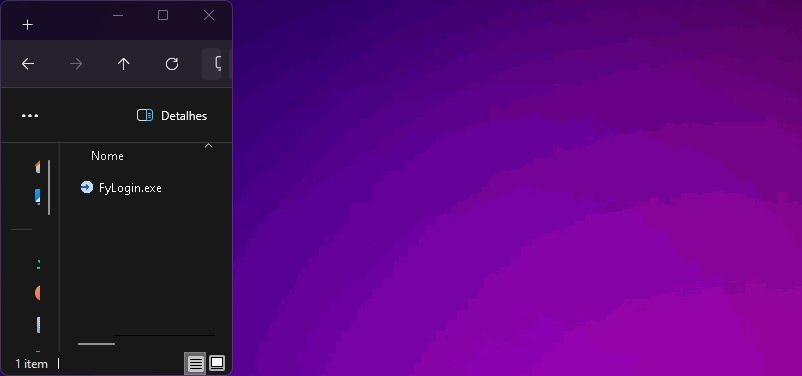

# FyLogin

## Uma aplicação Desktop criada para exemplificar o uso do toolkit [Fyne](https://Fyne.io) com a linguagem [Golang](https://go.dev)

### Exemplo da aplicação

___

### Video onde mostro o passo a passo da criação!

[**YouTube Video**](https://youtu.be/VkqCIIPLY24)

